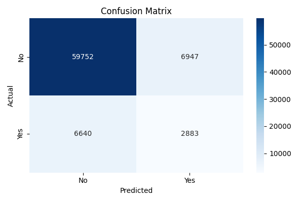

🧠 Insurance Claim Prediction using Decision Tree

This project uses a Decision Tree Classifier to predict whether a customer will opt for vehicle insurance, based on features like age, vehicle damage history, gender, and annual premium.

---
🔍 What I Did

- Cleaned and prepared the raw dataset
- Converted categorical features using label encoding
- Built a Decision Tree model with `sklearn`
- Evaluated model performance using accuracy, confusion matrix, and classification report
- Visualized the confusion matrix with `Seaborn`

---
🎯 Goal

To explore how Decision Trees can help classify customer insurance decisions based on key behavioral and demographic features. This project builds upon my previous logistic regression implementation.

---
📊 Model Performance

- **Accuracy:** 82.17%
- **Confusion Matrix:**  
  

---
🛠️ 
Tech Stack

- Python
- Pandas, NumPy
- scikit-learn
- Matplotlib & Seaborn
- VS Code
---
🔗 Other Projects

👉 [Logistic Regression Project Repo](https://github.com/nagasai-data/insurance_logisticregression)
---
🔜 Next Step

Up next: exploring **Random Forest** for further performance improvement and comparison!

📬 Let’s Connect  
📎 [LinkedIn](https://www.linkedin.com/in/naga-sai-dintakurthi-87b350332/)
